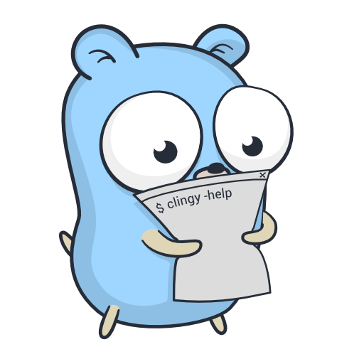

<p align="center">
<a href="https://pkg.go.dev/github.com/zeebo/clingy"></a>
<p align="center">
  <a href="https://pkg.go.dev/github.com/zeebo/clingy"></a>
  <a href="https://goreportcard.com/report/github.com/zeebo/clingy"></a>
  <a href="https://sourcegraph.com/github.com/zeebo/clingy?badge"></a>
  
</p>
</p>

<hr>

[Simple example](https://go.dev/play/p/YnZ4ZNyr7BQ)
```go
package main

import (
	"context"
	"fmt"
	"os"

	"github.com/zeebo/clingy"
)

func main() {
	ctx := context.Background()
	ok, err := clingy.Environment{
		Root: new(cmdHello),
	}.Run(ctx, nil)
	if err != nil {
		fmt.Fprintf(os.Stderr, "%+v\n", err)
	}
	if !ok || err != nil {
		os.Exit(1)
	}
}

type cmdHello struct{}

func (c *cmdHello) Setup(params clingy.Parameters) {}
func (c *cmdHello) Execute(ctx context.Context) error {
	fmt.Fprintln(clingy.Stdout(ctx), "Hello world!")
	return nil
}
```

<hr>

[More complete example](https://go.dev/play/p/-qCflV7eLxi)

```go
package main

import (
	"context"
	"fmt"
	"os"
	"strconv"

	"github.com/zeebo/clingy"
)

func main() {
	ctx := context.Background()
	ok, err := clingy.Environment{
		Args: []string{"group", "hello", "-s", "zeebo"},
	}.Run(ctx, func(cmds clingy.Commands) {
		cmds.Group("group", "a group of commands", func() {
			cmds.New("hello", "print a greeting", new(cmdHello))
		})
		cmds.New("panic", "oh no! a panic!", new(cmdPanic))
	})
	if err != nil {
		fmt.Fprintf(os.Stderr, "%+v\n", err)
	}
	if !ok || err != nil {
		os.Exit(1)
	}
}

type cmdHello struct {
	name    string
	spanish bool
}

func (c *cmdHello) Setup(params clingy.Parameters) {
	c.spanish = params.Flag("spanish", "greet in spanish", false,
		clingy.Short('s'),
		clingy.Transform(strconv.ParseBool),
		clingy.Boolean,
	).(bool)

	c.name = params.Arg("name", "person to greet").(string)
}

func (c *cmdHello) Execute(ctx context.Context) error {
	if c.spanish {
		fmt.Fprintln(clingy.Stdout(ctx), "Hola", c.name)
	} else {
		fmt.Fprintln(clingy.Stdout(ctx), "Hello", c.name)
	}
	return nil
}

type cmdPanic struct {
	frames int
}

func (c *cmdPanic) Setup(params clingy.Parameters) {
	c.frames = params.Arg("frames", "additional stack frames before panic",
		clingy.Transform(strconv.Atoi),
	).(int)
}

func (c *cmdPanic) Execute(ctx context.Context) error {
	var recur func(int)
	recur = func(x int) {
		if x <= 0 {
			panic("!!")
		}
		recur(x - 1)
	}
	recur(c.frames)
	panic("unreachable")
}
```
